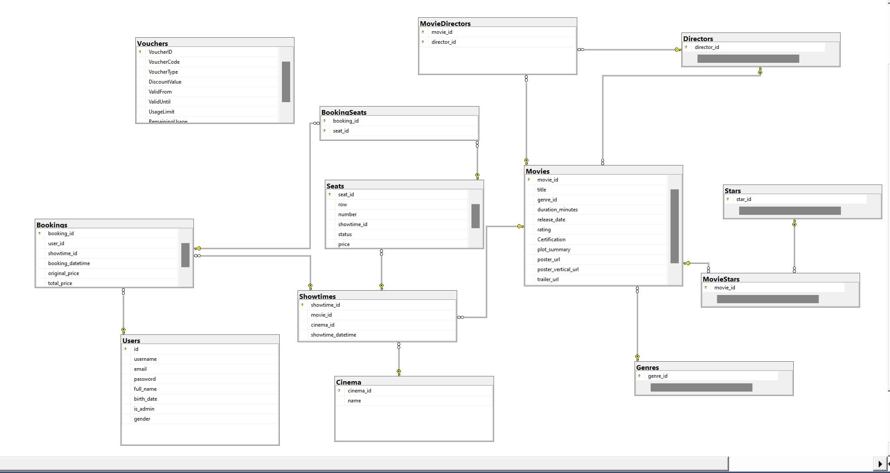

# Booking Movie Ticket Window App 
## TechStack
- WPF, Entity Framework, SQLServer, MVVM model

## Description
- A Windows application for booking movie tickets similar to CGV, Cinestar, and Lotte Cinema.
 
## Stakeholders
- User: Can book movie tickets, track orders, search for movies, update profile, apply vouchers, and view movie information.
- Admin: Can manage showtimes, vouchers, users, and movie information.

## Database Design

## Link
- [DemoLink](https://youtu.be/SZxt8kigtkU)
- [Documentation](https://drive.google.com/file/d/1vqzHXQGZi2dcL5dfmNnZvzFw_vm8FWpX/view?usp=sharing)
